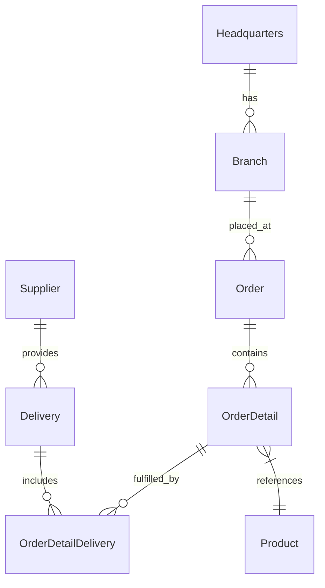
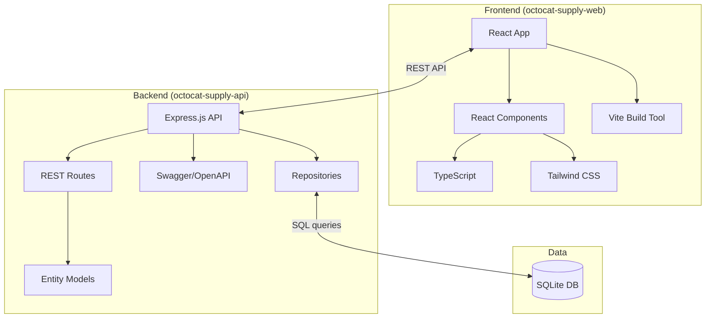

# OctoCAT Supply Chain Management System Architecture

The OctoCAT Supply Chain Management application is a TypeScript-based system comprising a backend REST API and a React frontend, designed for managing suppliers, products, orders, deliveries, branches, and headquarters.

## Architecture Overview

### Backend Architecture (octocat-supply-api)
- Express.js API with RESTful endpoints for all entities
- SQLite persistence using a lightweight repository pattern
- Schema migrations and seed data managed via SQL files
- Swagger/OpenAPI documentation integration
- Entity models with proper relationships following an ERD diagram
- Layered architecture: Routes → Repositories → SQLite Database

### Frontend Architecture (octocat-supply-web)
- React 18+ with TypeScript
- Vite build tool for fast development
- Tailwind CSS for UI styling
- React Router v7 for routing
- React Query for server-state cache
- Context providers for Auth and Theme

### DevOps Integration
- Docker / Docker Compose for containerization
- Bicep + GitHub Actions for Azure Container Apps deployment

## ERD

## Component Architecture

## Key Features

- Complete REST APIs for all supply chain entities
- SQLite-backed persistence with foreign keys and indexed queries
- Declarative migrations and deterministic seed data
- Detailed OpenAPI documentation
- Modern React UI with responsive design
- Containerization for consistent deployment
